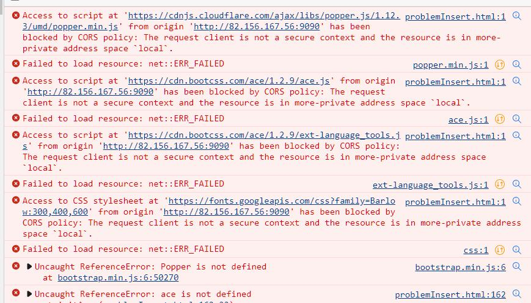

项目上线之后总是发生跨域的问题无法解决，看了很多解答，做了很多测试
发现以下几点有用

\<script src="" />这个标签引入的外部js连接总是发生跨域问题？

现在 Goole\Edge 浏览器版本升级，对跨域的要求更高了，所以无法引入其他连接的js文件

0、FireFox 可以正常访问，不会发生跨域的问题

1、网站升级成 https

2、修改浏览器配置，本地测试有效，看知乎的回答 https://zhuanlan.zhihu.com/p/414533145

3、后端设置跨域相关配置类，给所有controller加上@CrossOrigin,

或者写一个基类Controller，所有controller都继承，给基类加上@CrossOrigin

第三点亲测有效，对所有浏览器都有用，但是这样的作法很搞不懂为什么？因为前端的跨域问题不涉及到访问后端接口，但是能通过后端跨域配置解决，也是迷惑操作.....